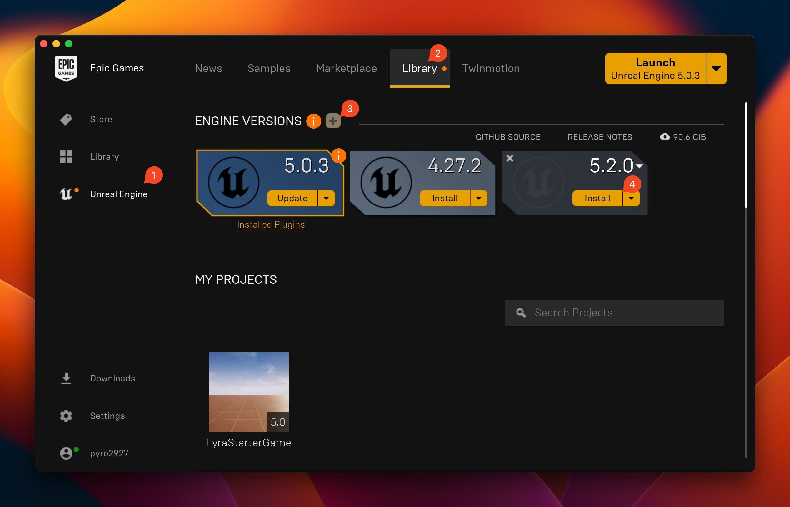
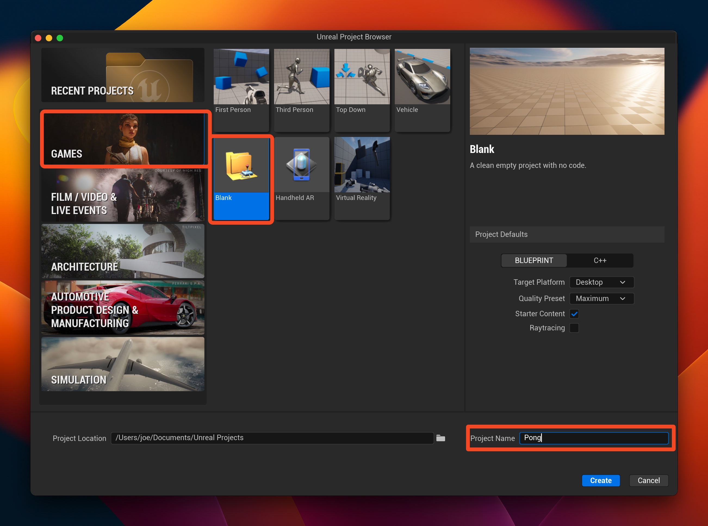
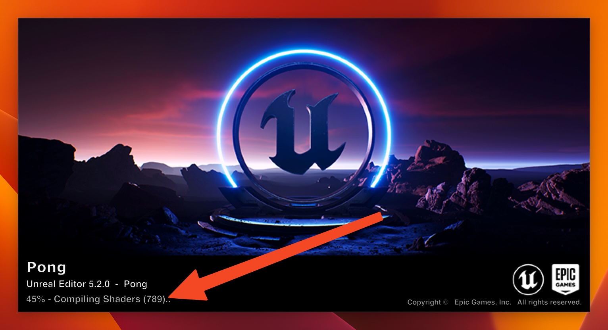

# Welcome to Week 0

## Goals

* Have Unreal installed and setup on your machine
* Have a blank project ready to go for Week 1

## Information

### Game Engines

Game engines are tools and frameworks that help make game development easier. Just like Rails accelerates making a Ruby backend, or React helps speed up Javascript frontend development, engines take care of most of the boilerplate things in game development so the actual **game** can be focused on. Compared to things like Rails and React however, they're very big. Unreal Engine 5 is roughly 100Gb once installed on your machine.

#### Download and Setup Unreal

1. Create an [Unreal account](https://www.unrealengine.com/en-US) if needed (if you've made an account to play Fortnite you can use that)
2. [Download the Epic Games Launcher](https://www.unrealengine.com/en-US/download)
3. Install Unreal Engine 5.2 by using the launcher (click "Unreal Engine" on the left, "Library" at the top, the "+" next to "Engine Versions", and finally "Install" within the "5.2.0" box that appears)

Depending on your internet speed, it may take several minutes or several hours to download Unreal Engine.

4. After Unreal is installed, open it up and create a new project (Games > Blank). Name it "Pong"

5. Wait... The first time Unreal opens it is going to "Compile Shaders". On some machines this can take up to an hour. The good news is that it only takes a long time the first time you open or start a new project, as the compiled results are cached on your internal storage.

## Bonus Levels

### Source Control

Projects in the gaming industry tend to have large binary files, which git does not traditionally handle well. While it is true that [git-lfs](https://git-lfs.com/) exists, it is a relatively recent development. Many studios use [Perforce](https://www.perforce.com/) (also known as "Helix Core"). There aren't many good resources comparing git and Perforce online, but [this Stackoverflow answer](https://stackoverflow.com/a/2778344) does a decent job.
