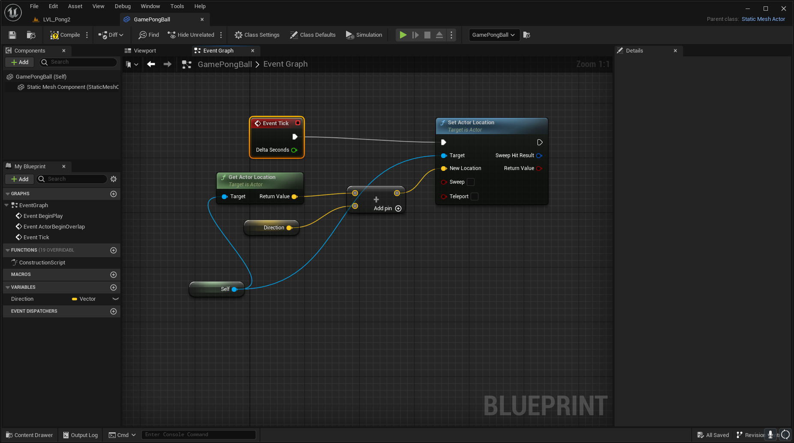
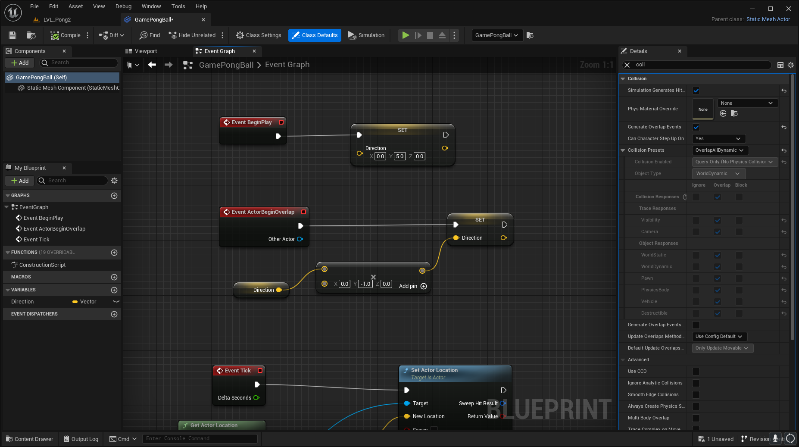

# Welcome to Week 2

## Goals

* Move our ball
* Bounce off the paddles

## Information

### Movement

In order to move our ball, we're going to update its location during the `Tick` event. [Actor Ticking](https://docs.unrealengine.com/4.26/en-US/ProgrammingAndScripting/ProgrammingWithCPP/UnrealArchitecture/Actors/Ticking/) is a very important concept in not just Unreal, but all games. You can think of it like a `while(true)` loop that continues to run until the game is closed (or crashes). For an easier time handling variables, we will store the ball's `Direction` as a single 3-dimensional vector, which we can then update later when the ball collides with walls or paddles.

### Collisions

Unreal Engine has a variety of ways of [dealing with collisions](https://docs.unrealengine.com/5.2/en-US/collision-in-unreal-engine---overview/), whether that be with *hits* or *overlaps*. We can use this to to trigger `ActorBeginOverlap` events, and update the ball's direction accordingly. The important thing to keep in mind here is that our StaticMesh actors won't have collision detection turned on by default, so we need to set "Generate Overlap Events" to `true`, and set our "Collision Preset" to "Overlap All Dynamic". This will ensure we tell the game engine that we care when the ball and paddles hit one another.

## Bonus Levels

### Reflection

Calculating the angle for a ball to bounce at is no different than calculating the angle of reflection of a beam of light. [It can be quite complex](https://www.youtube.com/watch?v=naaeH1qbjdQ), but thankfully Unreal has a "Get Reflection Vector" function we can just use!
